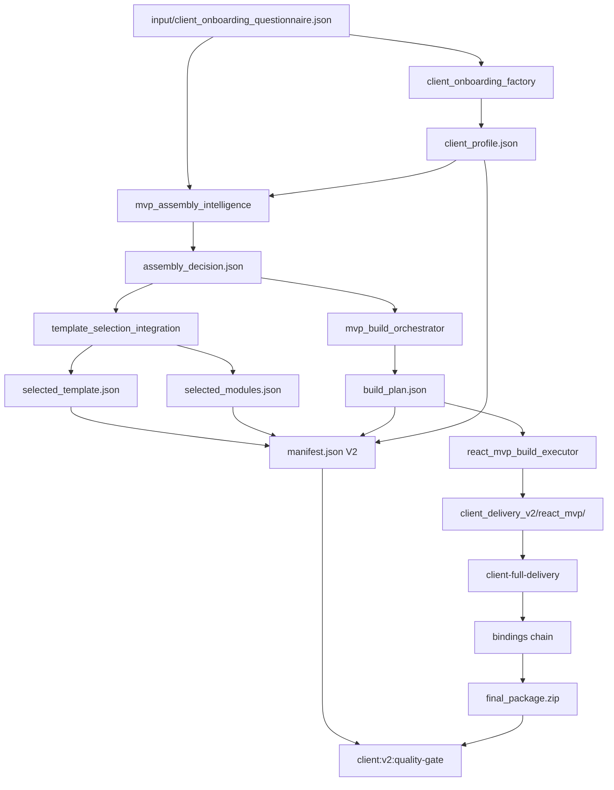

# CLIENT_DELIVERY_V2 — Architecture Plan

**Date:** 2026-06-14  
**Scope:** Design only. No code changes in this document.  
**Goal:** Questionnaire V1 must drive real template/module selection and produce a **rebuilt** React MVP per business type, then bind client data, demo, deploy, and ZIP.

---

## 1. Problem Statement

### Current state (V1 — `npm run client:deliver`)

| Stage | What happens |
|-------|----------------|
| Input | `input/client_onboarding_questionnaire.json` (8 visible fields + hidden defaults) |
| Onboarding | `client_onboarding_factory` → `client_profile.json` |
| Category | `business_type` → `selected_business_category` via `config/knowledge_category_map.json` |
| React MVP | **Pre-built** tree at `artifacts/factory_output/react_ui/client_package/` — **not rebuilt** |
| Binding | `react_ui_binding_factory` patches `uiClientData.ts` + a few components |
| Output | `output/client_delivery/final_package.zip` |

**Symptom:** `barbershop`, `dental_clinic`, and `car_service` all ship the same dashboard layout (calendar, CRM, staff, appointments).  
`business_type` affects metadata and knowledge pack path only.

### Target state (V2)

```
client_onboarding_questionnaire.json
        ↓
manifest.json (client_delivery_v2)
        ↓
business_type
        ↓
selected_business_category
        ↓
template_selection
        ↓
modules
        ↓
React MVP rebuild
        ↓
client data binding
        ↓
demo video
        ↓
deploy
        ↓
final_package.zip
```

**Success criterion:** Two runs with identical contacts but different `business_type` (`barbershop` vs `dental_clinic`) must produce **different** `template_id`, `selected_modules`, and **materially different** React source/build artifacts.

---

## 2. Architecture Overview

### 2.1 Two pipelines today

```
┌─────────────────────────────────────────────────────────────────────────┐
│ V1 Client Delivery (npm run client:deliver)                             │
│ onboarding → profile edit → bindings → ZIP                              │
│ React source: STATIC react_ui/client_package                            │
└─────────────────────────────────────────────────────────────────────────┘

┌─────────────────────────────────────────────────────────────────────────┐
│ Full V5 Pipeline (npm run full-v5:pipeline)                             │
│ assembly → template selection → build orchestrator → react_mvp build    │
│ → client_package → mvp_package.zip                                      │
│ React source: REBUILT artifacts/factory_output/react_mvp/               │
│ NOT connected to client:deliver or final_package.zip                    │
└─────────────────────────────────────────────────────────────────────────┘
```

### 2.2 V2 target — merged pipeline

```
┌──────────────────────────────────────────────────────────────────────────┐
│ CLIENT_DELIVERY_V2 (npm run client:deliver:v2)                           │
├──────────────────────────────────────────────────────────────────────────┤
│ [A] Questionnaire & manifest                                             │
│     input/client_onboarding_questionnaire.json                           │
│     → client_onboarding_factory                                        │
│     → client_delivery_v2/manifest.json                                   │
├──────────────────────────────────────────────────────────────────────────┤
│ [B] Assembly & template (from Full V5)                                   │
│     mvp_assembly_intelligence_factory                                  │
│     → template_selection_integration_factory                             │
│     → mvp_build_orchestrator_factory                                     │
├──────────────────────────────────────────────────────────────────────────┤
│ [C] React MVP rebuild (NEW bridge layer)                                   │
│     react_mvp_build_executor_factory                                     │
│     → react_mvp_business_content_integration_factory (optional enrich) │
│     OR react_ui_from_build_plan_factory (Phase 2 — rich dashboard)       │
├──────────────────────────────────────────────────────────────────────────┤
│ [D] Client bindings (adapted V1 tail)                                    │
│     client-data → integrate → react-ui-binding → demo → deploy → ZIP     │
├──────────────────────────────────────────────────────────────────────────┤
│ [E] Quality gate                                                         │
│     client:v2:quality-gate                                               │
└──────────────────────────────────────────────────────────────────────────┘
```

**Design principle:** Reuse Full V5 decision factories as-is; add a thin **orchestrator + manifest V2 + React path adapter**; keep V1 binding tail with configurable React root.

---

## 3. Full V5 Module Reuse Analysis

### 3.1 `mvp_assembly_intelligence_factory` — **REUSE (core)**

| Aspect | Detail |
|--------|--------|
| Entry | `npm run mvp-assembly-intelligence:generate` |
| Input | Already reads `input/client_onboarding_questionnaire.json` + `client_profile.json` + `knowledge_library/{lang}/{category}/` |
| Output | `artifacts/factory_output/mvp_assembly_intelligence/assembly_decision.json` |
| Value | Rule-based `selected_template`, `selected_ui`, `selected_modules` from category + knowledge features |

**Key fields produced:**

```json
{
  "business_type": "barbershop",
  "selected_business_category": "beauty_salon",
  "selected_template": "beauty_salon_crm",
  "selected_ui": "dashboard_modern",
  "selected_modules": ["booking", "crm", "notifications"],
  "knowledge_pack_used": "knowledge_library/de/beauty_salon"
}
```

**Gap to fix in implementation:** `assembly_rules.py` uses legacy keys (`dentist`, `automotive_service`) while `knowledge_category_map.json` emits `dental_clinic`, `car_service`. V2 must add **category normalization** (single map in config or alias layer) so `dental_clinic` resolves to `medical_crm` template, not `consulting_crm` fallback.

---

### 3.2 `template_selection_integration_factory` — **REUSE (core)**

| Aspect | Detail |
|--------|--------|
| Entry | `npm run template-selection-integration:generate` |
| Input | `assembly_decision.json` |
| Output | `selected_template.json`, `selected_modules.json`, `selected_ui.json` |

Splits assembly decision into discrete artifacts required by manifest V2 and build orchestrator. No changes needed to selection logic.

---

### 3.3 Pattern / module selection — **PARTIAL REUSE**

V2 consolidates three existing mechanisms:

| Module | Role in V2 | Reuse |
|--------|------------|-------|
| `mvp_assembly_intelligence_factory/assembly_rules.py` | Primary module list (`FEATURE_TO_MODULE`, `DEFAULT_MODULES_BY_CATEGORY`) | **Primary** |
| `knowledge_library_integration_factory/knowledge_router.py` | `business_type` → category + pack folder | **Primary** (already in onboarding) |
| `ui_library_factory` | UI pattern matching from modules + legacy questionnaire manifest | **Phase 2** — use when upgrading to full `react_ui_factory` dashboard |
| `knowledge_router_factory` | Legacy router from `artifacts/factory_output/questionnaire/manifest.json` | **Do not use** — wrong input source for Client Questionnaire V1 |

**Recommendation:** V2 Phase 1 uses assembly + template selection only. Phase 2 optionally runs `ui_library_factory` after copying V2 manifest fields into a adapter manifest for richer UI patterns.

---

### 3.4 `react_ui_factory` — **REUSE WITH ADAPTER (Phase 2)**

| Aspect | Detail |
|--------|--------|
| Entry | `npm run react-ui:generate` |
| Current inputs | `mvp_polish/`, `ui_library/`, legacy `questionnaire/manifest.json`, `domain_transformation/`, `i18n/` |
| Output | `artifacts/factory_output/react_ui/client_package/` (rich dashboard) |
| V2 role | **Not called directly in Phase 1.** V1 delivery depends on this pre-built artifact. |

**Phase 2 adapter (`react_ui_from_build_plan_factory`):**

- Input: `build_plan.json` + `client_delivery_v2/manifest.json` + knowledge pack demo data
- Output: `artifacts/factory_output/client_delivery_v2/react_mvp/` (or symlink target for bindings)
- Replaces hardcoded `DashboardPage.tsx` module list with module-gated sections from `selected_modules.json`

---

### 3.5 `react_mvp_build_executor_factory` — **REUSE (Phase 1 rebuild)**

| Aspect | Detail |
|--------|--------|
| Entry | `npm run react-mvp-build-executor:generate` |
| Input | `artifacts/factory_output/mvp_build_orchestrator/build_plan.json` |
| Output | `artifacts/factory_output/react_mvp/` (Vite scaffold + `build_plan.json` embedded) |
| V2 role | **First working rebuild path** — template/modules visible in generated App and data files |

Phase 1 uses this because it already consumes `build_plan.json` end-to-end. UI is minimal but **different per business type** (template id, module cards, business_profile.json).

Optional follow-up: `npm run react-mvp-business-content:integrate` injects domain demo content from knowledge packs.

---

### 3.6 `demo_video_factory` + bindings — **REUSE (tail)**

| Factory | V1 usage | V2 change |
|---------|----------|-----------|
| `demo_video_binding_factory` | Reads client profile, patches demo metadata | Point demo slug/title at V2 manifest |
| `client_demo_video_factory` | Standalone demo generation | Unchanged |
| `scripts/build-demo-video.mjs` | Legacy | Unchanged |

Bindings stay in client pipeline; only ensure demo reads `manifest.json` `business_name` + `template_id`.

---

### 3.7 Deploy factories — **REUSE (tail)**

| Factory | Role |
|---------|------|
| `deploy_binding_factory` | Binds deploy metadata from profile |
| `deploy_factory` | Generates deploy config |
| `netlify_deploy_factory` | Netlify path when `delivery_method=netlify` |

V2: read `delivery_method` from manifest V2 (currently stored but ignored in V1).

---

### 3.8 `final_package_binding_factory` — **REUSE WITH EXTENSIONS**

| Aspect | Detail |
|--------|--------|
| Entry | `npm run final-package-binding:generate` (inside client pipeline) |
| Current | Rebuilds `output/final_package.zip` from static React + `package_client_data.json` |
| V2 extensions | Include `template_id`, `selected_modules`, `assembly_decision` snapshot in ZIP manifest; copy from `client_delivery_v2/react_mvp/` instead of `react_ui/client_package/` |

Existing validators (`zip_manifest_matches_package_data`, `ensure_final_package_rebuild_inputs`) should be extended, not replaced.

---

### 3.9 Modules NOT reused in V2 client path

| Module | Reason |
|--------|--------|
| `client_package_from_react_mvp_factory` | Produces `output/mvp_package.zip` — different packaging contract than `final_package.zip`; merge logic into V2 final binding instead |
| Full V5 runner as-is | Writes to separate artifact tree; V2 needs client-specific manifest + `output/client_delivery/` layout |
| Legacy `questionnaire/manifest.json` factory chain | Superseded by `client_onboarding_questionnaire.json` |

---

## 4. Files to Wire into `client:deliver:v2`

### 4.1 Input files (read)

| File | Purpose |
|------|---------|
| `input/client_onboarding_questionnaire.json` | Primary questionnaire source (UI POST target) |
| `config/knowledge_category_map.json` | `business_type` → `selected_business_category` + pack aliases |
| `knowledge_library/{language}/{pack_folder}/*.json` | Features, CRM modules, demo seeds |
| `artifacts/factory_output/client_data/client_profile.json` | Enriched profile after onboarding |

### 4.2 Decision chain (generated)

| File | Producer |
|------|----------|
| `artifacts/factory_output/mvp_assembly_intelligence/assembly_decision.json` | `mvp_assembly_intelligence_factory` |
| `artifacts/factory_output/template_selection_integration/selected_template.json` | `template_selection_integration_factory` |
| `artifacts/factory_output/template_selection_integration/selected_modules.json` | same |
| `artifacts/factory_output/template_selection_integration/selected_ui.json` | same |
| `artifacts/factory_output/mvp_build_orchestrator/build_plan.json` | `mvp_build_orchestrator_factory` |

### 4.3 V2 canonical manifest (new — written by orchestrator)

| File | Purpose |
|------|---------|
| `artifacts/factory_output/client_delivery_v2/manifest.json` | Single source of truth for delivery run |
| `artifacts/factory_output/client_delivery_v2/selected_template.json` | Copy/snapshot from template selection |
| `artifacts/factory_output/client_delivery_v2/selected_modules.json` | Copy/snapshot from template selection |

### 4.4 React rebuild output

| File / dir | Producer |
|------------|----------|
| `artifacts/factory_output/client_delivery_v2/react_mvp/` | `react_mvp_build_executor` (Phase 1) or adapter (Phase 2) |
| `artifacts/factory_output/client_delivery_v2/react_mvp/src/data/build_plan.json` | Embedded selection proof |
| `artifacts/factory_output/client_delivery_v2/react_mvp/dist/` | Production build (after `npm run build` in MVP dir) |

### 4.5 Binding chain (adapt paths)

| Factory | Path to update (implementation) |
|---------|--------------------------------|
| `react_ui_binding_factory/binding_manifest.py` | `REACT_CLIENT_DATA_TS_REL` → V2 react root |
| `react_ui_binding_factory/binding_report.py` | Validation paths for V2 client dir |
| `final_package_binding_factory/final_package_mapper.py` | Add template/modules to `package_metadata` |
| `final_package_binding_factory/binding_report.py` | Validate V2 manifest fields in ZIP |

### 4.6 Output files

| File | Purpose |
|------|---------|
| `output/client_delivery/final_package.zip` | Client-facing deliverable (same location as V1 for compatibility) |
| `output/client_delivery/demo.mp4` | Demo video |
| `output/client_delivery/client_summary.txt` | Human summary |
| `artifacts/factory_output/client_delivery_v2/final_package.zip` | Mirror/copy for V2 artifact tree |
| `artifacts/factory_output/client_delivery_v2/delivery_report.json` | Run report |

### 4.7 New factory module (to implement)

```
factory/client_delivery_v2_orchestrator/
  client_delivery_v2_manifest.py      # manifest schema + paths
  client_delivery_v2_runner.py        # step runner
  client_delivery_v2_validator.py     # quality checks
  client_delivery_v2_orchestrator.py  # entry point

factory/client_delivery_v2_quality_gate/
  quality_gate_manifest.py
  quality_gate_runner.py
  quality_gate_validator.py
```

Pattern: mirror `client_one_command_delivery_factory` + `full_v5_pipeline_runner_factory` structure.

---

## 5. Manifest V2 Schema

**Path:** `artifacts/factory_output/client_delivery_v2/manifest.json`

```json
{
  "version": "2.0.0",
  "status": "DELIVERY_READY",
  "llm_used": false,
  "generated_at": "2026-06-14T12:00:00+00:00",
  "factory": "CLIENT_DELIVERY_V2_ORCHESTRATOR",
  "pipeline": "CLIENT_DELIVERY_V2",

  "business_type": "barbershop",
  "selected_business_category": "beauty_salon",
  "template_id": "beauty_salon_crm",
  "selected_ui": "dashboard_modern",
  "modules": ["booking", "crm", "notifications"],
  "language": "de",
  "delivery_method": "zip",

  "client_contacts": {
    "business_name": "Berlin Barber Studio",
    "phone": "+49 30 5551234",
    "whatsapp": "+49 30 5551234",
    "telegram": "@berlin_barber",
    "email": "hello@berlin-barber.example"
  },

  "knowledge_pack_used": "knowledge_library/de/beauty_salon",
  "assembly_reason": "Beauty salon requires booking, client management and notifications.",

  "sources": {
    "questionnaire": "input/client_onboarding_questionnaire.json",
    "client_profile": "artifacts/factory_output/client_data/client_profile.json",
    "assembly_decision": "artifacts/factory_output/mvp_assembly_intelligence/assembly_decision.json",
    "build_plan": "artifacts/factory_output/mvp_build_orchestrator/build_plan.json"
  },

  "outputs": {
    "selected_template": "artifacts/factory_output/client_delivery_v2/selected_template.json",
    "selected_modules": "artifacts/factory_output/client_delivery_v2/selected_modules.json",
    "react_mvp": "artifacts/factory_output/client_delivery_v2/react_mvp/",
    "final_package": "output/client_delivery/final_package.zip"
  },

  "pipeline_steps": [
    "client-onboarding:generate",
    "mvp-assembly-intelligence:generate",
    "template-selection-integration:generate",
    "mvp-build-orchestrator:generate",
    "react-mvp-build-executor:generate",
    "client-full-delivery:run",
    "client:v2:quality-gate"
  ]
}
```

### Field mapping

| Manifest V2 field | Source |
|-------------------|--------|
| `business_type` | questionnaire.raw |
| `selected_business_category` | `assembly_decision.selected_business_category` |
| `template_id` | `selected_template.selected_template` |
| `modules` | `selected_modules.selected_modules` |
| `language` | questionnaire |
| `delivery_method` | questionnaire (finally consumed) |
| `client_contacts` | questionnaire contact fields |

### Snapshot files

**`selected_template.json`** — copy of template selection output with `manifest_version: "2.0.0"` stamp.

**`selected_modules.json`** — copy of module selection output with category + business_type echoed for diff tests.

---

## 6. Verification: barbershop vs dental_clinic

### 6.1 Test matrix

| Run | `business_type` | Expected category | Expected template | Expected modules (typical) |
|-----|-----------------|-------------------|-------------------|--------------------------|
| A | `barbershop` | `beauty_salon` | `beauty_salon_crm` | `booking`, `crm`, `notifications` |
| B | `dental_clinic` | `dental_clinic`* | `medical_crm`* | `appointments`, `crm`, `notifications`* |

\*After category normalization fix (`dental_clinic` → `dentist` rules key).

Knowledge pack features driving modules:

- `knowledge_library/de/beauty_salon/features.json` → booking-oriented
- `knowledge_library/de/dentist/features.json` → appointments / patient_records oriented

### 6.2 Automated diff checks (quality gate)

```bash
# 1. Run barbershop delivery
# Edit input/client_onboarding_questionnaire.json → business_type=barbershop
npm run client:deliver:v2

# 2. Save artifacts
cp -r artifacts/factory_output/client_delivery_v2 /tmp/v2_barbershop

# 3. Run dental_clinic delivery
# Edit questionnaire → business_type=dental_clinic, change business_name
npm run client:deliver:v2

# 4. Diff critical files
diff /tmp/v2_barbershop/manifest.json \
     artifacts/factory_output/client_delivery_v2/manifest.json

diff /tmp/v2_barbershop/selected_modules.json \
     artifacts/factory_output/client_delivery_v2/selected_modules.json

diff /tmp/v2_barbershop/react_mvp/src/data/build_plan.json \
     artifacts/factory_output/client_delivery_v2/react_mvp/src/data/build_plan.json
```

**PASS conditions:**

| Check | barbershop | dental_clinic |
|-------|------------|---------------|
| `manifest.template_id` | `beauty_salon_crm` | `medical_crm` |
| `manifest.modules` | contains `booking` | contains `appointments` |
| `build_plan.json` | differs from dental | differs from barbershop |
| `react_mvp/src/data/business_profile.json` | `business_type: barbershop` | `business_type: dental_clinic` |
| ZIP `manifest.json` | includes template_id + modules | same structure, different values |
| React App render | module section lists booking | module section lists appointments |

### 6.3 Quality gate assertions (implement in `client_delivery_v2_quality_gate`)

1. `manifest.json` exists and `version >= 2.0.0`
2. `template_id` non-empty and ≠ `consulting_crm` for known business types
3. `modules.length >= 3`
4. `react_mvp/package.json` exists and `npm run build` succeeded
5. `build_plan.json.template` === `manifest.template_id`
6. `final_package.zip` contains `client_data/client_profile.json` with matching `business_type`
7. **Cross-run regression:** stored golden files for barbershop + dental_clinic; CI diff job
8. V1 regression guard: `template_id` in ZIP manifest must be present (proves V2 ran, not V1 static path)

### 6.4 Manual smoke test

1. Open extracted `app/client_package/` from each ZIP
2. Confirm different `build_plan.json` / module labels in UI
3. Confirm `business_name` contact binding works in both

---

## 7. Commands

### 7.1 `npm run client:deliver:v2`

**Proposed implementation:** new Python module `factory/client_delivery_v2_orchestrator/`.

**Step sequence:**

| Step | Command | Notes |
|------|---------|-------|
| 1 | `npm run client-onboarding:generate` | Questionnaire → profile |
| 2 | `npm run mvp-assembly-intelligence:generate` | Template/module decision |
| 3 | `npm run template-selection-integration:generate` | Split artifacts |
| 4 | `npm run mvp-build-orchestrator:generate` | Unified build_plan.json |
| 5 | `npm run react-mvp-build-executor:generate` | Rebuild react_mvp |
| 6 | *(internal)* | Copy react_mvp → `client_delivery_v2/react_mvp/`, write manifest V2 |
| 7 | `npm run client-full-delivery:run` | Profile edit + bindings + ZIP (with V2 React root env/flag) |
| 8 | `npm run client:v2:quality-gate` | Validate |

**package.json entry (to add in implementation):**

```json
"client:deliver:v2": "python3 -m factory.client_delivery_v2_orchestrator.client_delivery_v2_orchestrator"
```

**Environment flag for binding tail (implementation detail):**

```
CLIENT_DELIVERY_REACT_ROOT=artifacts/factory_output/client_delivery_v2/react_mvp
```

Allows reusing V1 binding factories without duplicating logic.

### 7.2 `npm run client:v2:quality-gate`

**Purpose:** V2-specific validation beyond V1 `final-v3:quality-gate`.

**Checks beyond V3 gate:**

| Block | Checks |
|-------|--------|
| Manifest V2 | Schema, required fields, template/modules present |
| Assembly chain | assembly_decision → build_plan consistency |
| React rebuild | react_mvp dir fresh (mtime after assembly), build_plan embedded |
| Differentiation | template_id matches category map expectations |
| ZIP | template_id + modules in package manifest |
| llm_used | false across all reports |

**package.json entry (to add):**

```json
"client:v2:quality-gate": "python3 -m factory.client_delivery_v2_quality_gate.client_delivery_v2_quality_gate_factory"
```

**Relationship to V1 gate:**

- V2 gate **includes** critical V3 checks (ZIP exists, demo, deploy reports) by calling shared validators or running `final-v3:quality-gate` as sub-step
- V2 gate **adds** template/module differentiation checks V3 does not have

---

## 8. Expected Artifacts

After successful `npm run client:deliver:v2`:

```
artifacts/factory_output/client_delivery_v2/
├── manifest.json                    ← canonical V2 manifest
├── selected_template.json           ← snapshot
├── selected_modules.json            ← snapshot
├── react_mvp/                       ← rebuilt React project
│   ├── package.json
│   ├── src/data/build_plan.json
│   ├── src/data/business_profile.json
│   ├── src/data/modules.json
│   └── dist/                        ← production build
├── delivery_report.json             ← step statuses
├── validation_report.json           ← quality gate results
├── CLIENT_DELIVERY_V2_ORCHESTRATOR_V1_PASS.txt
└── final_package.zip                ← mirror (optional; primary in output/)

artifacts/factory_output/mvp_assembly_intelligence/
├── assembly_decision.json
└── assembly_report.json

artifacts/factory_output/template_selection_integration/
├── selected_template.json
├── selected_modules.json
└── selected_ui.json

artifacts/factory_output/mvp_build_orchestrator/
└── build_plan.json

output/
├── final_package.zip                ← rebuilt from V2 react + bindings
└── client_delivery/
    ├── final_package.zip
    ├── demo.mp4
    ├── client_summary.txt
    └── delivery_report.json

output/CLIENT_DELIVERY_V2_QUALITY_GATE_V1_PASS.txt
```

---

## 9. Implementation Phases

### Phase 1 — Minimal viable V2 (template-aware rebuild)

**Goal:** Different `template_id` + `modules` + `build_plan.json` per business type; ZIP ships rebuilt react_mvp.

1. Create `client_delivery_v2_orchestrator` (steps 1–8 above)
2. Fix category key alignment (`dental_clinic`, `car_service` → assembly_rules keys)
3. Add manifest V2 writer + artifact snapshots
4. Parameterize `react_ui_binding_factory` React root via env var
5. Extend `final_package_mapper` with template/modules metadata
6. Add `client:v2:quality-gate` with diff assertions
7. Add npm scripts

**Exit criteria:** barbershop vs dental_clinic diff on manifest, modules, build_plan, ZIP metadata.

### Phase 2 — Rich dashboard parity

**Goal:** Module-gated dashboard comparable to current `react_ui_factory` output.

1. Implement `react_ui_from_build_plan_factory` (adapter)
2. Optionally wire `ui_library_factory` for pattern selection
3. Module-gated `DashboardPage` sections (hide calendar for restaurant vs dentist, etc.)
4. Regenerate i18n demo strings from knowledge pack per category

### Phase 3 — delivery_method routing

**Goal:** Honor `delivery_method` from questionnaire.

| Value | Action |
|-------|--------|
| `zip` | default final_package.zip |
| `netlify` | run `netlify-deploy:generate` + include deploy URL in manifest |
| `github` | run `github` factory + include repo URL |

---

## 10. Data Flow Diagram



---

## 11. Risks and Mitigations

| Risk | Impact | Mitigation |
|------|--------|------------|
| Category key mismatch (`dental_clinic` vs `dentist`) | dental_clinic gets wrong template | Unified `category_aliases` in config; normalize before assembly_rules lookup |
| `react_mvp` UI too minimal vs current dashboard | Client perceived downgrade in Phase 1 | Phase 2 adapter; document Phase 1 as "proof of selection" |
| barbershop → beauty_salon same template as beauty_salon | barbershop and beauty_salon identical MVP | Accept for Phase 1 OR add `business_type` sub-template override in V2.1 |
| Stale React from previous run | Wrong ZIP contents | Quality gate mtime check; orchestrator cleans `client_delivery_v2/react_mvp/` before rebuild |
| V1/V2 parallel confusion | Operators run wrong command | Keep `client:deliver` unchanged; V2 writes to distinct artifact dir; gate fails if manifest.version < 2 |

---

## 12. Summary

| Question | Answer |
|----------|--------|
| What changes vs V1? | Insert Full V5 assembly chain + React rebuild **before** bindings; manifest V2 drives paths |
| What is reused? | `mvp_assembly_intelligence`, `template_selection`, `mvp_build_orchestrator`, `react_mvp_build_executor`, entire binding tail, demo/deploy factories |
| What is new? | `client_delivery_v2_orchestrator`, manifest V2 schema, React root adapter, `client:v2:quality-gate` |
| How to prove differentiation? | Diff manifest/modules/build_plan; quality gate golden tests for barbershop vs dental_clinic |
| Primary deliverable path | `output/client_delivery/final_package.zip` (unchanged for downstream consumers) |

**Next step (implementation):** Phase 1 orchestrator + category normalization + binding path parameterization. No changes to Questionnaire V1 UI required.
