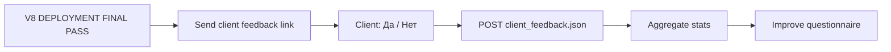

# POST_DEPLOYMENT_FEEDBACK_REVIEW

**Дата:** 2026-06-13  
**Контрольная точка:** V8 Deployment Full Pass  
**Тип документа:** архитектурный анализ (без изменений кода, без новых factory)

---

## Executive Summary

V8 pipeline доказывает **Factory Success** — все quality gates пройдены, artifacts согласованы, `llm_used=false`. Но система не измеряет **Client Success**: открыл ли клиент MVP, соответствует ли результат ожиданиям, готов ли платить.

Рекомендация: добавить **post-deployment feedback layer** как отдельный контур *после* V8, не меняя существующий pipeline. Минимально — бинарный ответ «Это то, что вы хотели?» + связь с manifest через `run_id`. Реализация возможна **без сложных factory**: один API endpoint + JSON artifacts + опциональный lightweight validator — по паттерну уже существующего `/client-questionnaire`.

---

## 1. Проблема

### Factory Success ≠ Client Success

```
Сегодня:
  Business Idea → Manifest → React MVP → Client Delivery → Deployment → DEPLOYMENT FINAL PASS
                                                                              ↑
                                                                    только технический аудит

Отсутствует:
  Client opened URL?     → неизвестно
  Client viewed MVP?     → неизвестно
  MVP matches expectations? → неизвестно
  Client ready to pay?   → неизвестно
  Issues found?          → неизвестно
```

### Пример разрыва

| Сигнал | Factory интерпретация | Client реальность |
|--------|----------------------|-------------------|
| `DEPLOYMENT FINAL PASS` | Pipeline готов | Клиент не открыл ссылку |
| `github_delivery PASS` | Package собран | Клиент не понял README |
| `client_delivery PASS` | Screenshots + demo OK | Клиент ожидал другие модули |
| `questionnaire ANSWERS_READY` | Данные собраны | Ожидания изменились после просмотра |

### Корневая причина

Pipeline оптимизирован под **deterministic artifact validation**, а не под **human outcome measurement**. Все текущие PASS-файлы отвечают на вопрос «фабрика отработала корректно?», а не «клиент доволен?».

---

## 2. Текущее состояние архитектуры

### Что уже есть (релевантное для feedback)

| Компонент | Путь / паттерн | Роль |
|-----------|----------------|------|
| Questionnaire input | `artifacts/factory_output/questionnaire/` | Pre-build: `business_type`, feature flags |
| Manifest | `config/manifest.yml`, `questionnaire/manifest.json` | Конфигурация pipeline |
| Client onboarding UI | `/client-questionnaire`, `input/client_onboarding_questionnaire.json` | Сбор данных **до** сборки |
| Deployment chain | `deployment_choice` → branch → `deployment_validation` → `deployment_final_quality_gate` | Post-build **технический** аудит |
| Linking key сегодня | `business_type` + `deployment_mode` + `generated_at` | **Нет** `manifest_id` / `run_id` |
| deployment_url | `netlify_deploy/deployment_url.txt`, `custom_domain/deployment_url.txt` | Только для netlify/custom_domain; **отсутствует** при `github_only` |

### Пробел идентификации

Сейчас artifacts связаны через `business_type: "beauty_salon"`, но:

- один business_type может иметь множество прогонов;
- `generated_at` в manifests не используется как foreign key;
- **`manifest_id` / `run_id` не существует** — feedback нельзя однозначно привязать к конкретному MVP run.

Это первый архитектурный блокер для post-deployment feedback.

---

## 3. Ответы на вопросы анализа

### 3.1. Какая минимальная обратная связь нужна?

**Минимум (MVP feedback):**

```
Это то, что вы хотели?
[ Да ]  [ Нет ]
```

Достаточно для бинарного `client_happy` и первого измерения Client Success rate.

**Расширение при `Нет` (1 экран, optional):**

| Поле | Тип | Обязательность |
|------|-----|----------------|
| `feedback_reason` | enum + free text | required if No |
| `issue_category` | enum | optional |

**Категории `issue_category` (starter set):**

- `wrong_modules` — не те модули
- `wrong_design` — дизайн/UI
- `wrong_business_type` — не тот тип бизнеса
- `missing_feature` — не хватает функции
- `too_complex` — слишком сложно
- `other`

**Не включать в минимум:** NPS, payment intent, analytics — это Phase 2.

---

### 3.2. Какие данные стоит сохранять?

#### Минимальная запись (`client_feedback.json`)

```json
{
  "feedback_id": "fb_20260613_beauty_salon_a1b2",
  "run_id": "run_20260613_151939",
  "manifest_ref": "artifacts/factory_output/questionnaire/manifest.json",
  "business_type": "beauty_salon",
  "deployment_mode": "github_only",
  "deployment_url": null,
  "client_happy": false,
  "feedback_result": "no",
  "feedback_reason": "Ожидал модуль payments",
  "issue_category": "missing_feature",
  "timestamp": "2026-06-13T18:00:00+00:00",
  "llm_used": false,
  "source": "client_feedback_form"
}
```

#### Полная запись (рекомендуемая Phase 2)

| Поле | Назначение |
|------|------------|
| `feedback_id` | UUID / deterministic hash |
| `run_id` | FK на конкретный pipeline run |
| `manifest_ref` | Путь к manifest artifact |
| `questionnaire_ref` | Путь к `answers.json` |
| `deployment_final_gate_ref` | Путь к V8.6 manifest |
| `business_type` | Для агрегации |
| `deployment_mode` | netlify / custom_domain / github_only |
| `deployment_url` | URL клиента (nullable для github_only) |
| `client_happy` | boolean — главная метрика |
| `feedback_result` | `"yes"` / `"no"` |
| `feedback_reason` | free text |
| `issue_category` | enum |
| `payment_ready` | `"yes"` / `"no"` / `"maybe"` / null |
| `url_opened_at` | timestamp (если tracking) |
| `feedback_submitted_at` | timestamp |
| `client_contact` | email (optional, from questionnaire) |
| `llm_used` | always `false` |

---

### 3.3. Как связать feedback с Manifest?

#### Проблема

Manifest сегодня — это **конфигурация**, а не **идентификатор run**. Нужен явный `run_id`.

#### Рекомендуемая модель связей

```
questionnaire/answers.json
        │
        ▼
questionnaire/manifest.json  ──►  config/manifest.yml
        │                              │
        └────────── run_id ────────────┘
                      │
        ┌─────────────┼─────────────┐
        ▼             ▼             ▼
  react_mvp/    client_delivery/  deployment_final_quality_gate/
  manifest      manifest           manifest
        │             │             │
        └─────────────┴─────────────┘
                      │
                      ▼
              client_feedback.json
              (run_id FK)
```

#### Способы генерации `run_id` (без LLM)

| Способ | Формула | Плюсы | Минусы |
|--------|---------|-------|--------|
| **A. Timestamp anchor** | `run_{generated_at из deployment_final_quality_gate}` | Просто, уже есть в artifacts | Коллизии при re-run в ту же секунду |
| **B. Content hash** | SHA256(manifest.yml + answers.json)[:12] | Deterministic, reproducible | Меняется при любом edit answers |
| **C. Explicit injection** | Записать `run_id` в V8.6 manifest при будущем расширении | Чистая FK | Требует изменения V8 (не сейчас) |

**Рекомендация для Phase 1 (без изменения V8):**

```text
run_id = "run_" + deployment_final_quality_gate_manifest.generated_at (normalized)
```

Связь feedback → manifest:

```text
manifest_ref = "artifacts/factory_output/questionnaire/manifest.json"
deployment_gate_ref = "artifacts/factory_output/deployment_final_quality_gate/deployment_final_quality_gate_manifest.json"
```

---

### 3.4. Как использовать feedback для улучшения опросника?

Feedback loop **не требует LLM** — только агрегация JSON artifacts.

```
┌─────────────────┐     aggregate      ┌──────────────────────┐
│ client_feedback │ ─────────────────► │ feedback_analytics   │
│ (per run)       │                    │ (by business_type)   │
└─────────────────┘                    └──────────┬───────────┘
                                                  │
                    ┌─────────────────────────────┼─────────────────────────────┐
                    ▼                             ▼                             ▼
           questionnaire              knowledge_library              module_catalog
           field weights               template gaps                  module selection
```

#### Конкретные улучшения опросника

| Сигнал feedback | Действие в опроснике |
|-----------------|---------------------|
| `issue_category: missing_feature` + reason mentions "payments" | Добавить explicit checkbox «Нужны платежи» с default по business_type |
| `wrong_business_type` часто для `restaurant_crm` | Уточнить описания business types в UI |
| `client_happy: false` при `payments: false` в answers | Корреляция → предложить payments по умолчанию для типа |
| `too_complex` | Добавить вопрос «Какой уровень сложности нужен?» (minimal / standard / full) |

#### Хранилище insights (future artifact)

```json
{
  "module": "QUESTIONNAIRE_IMPROVEMENT_INSIGHTS",
  "business_type": "beauty_salon",
  "feedback_count": 12,
  "client_happy_rate": 0.75,
  "top_issues": [
    {"category": "missing_feature", "count": 3, "examples": ["payments", "analytics"]}
  ],
  "recommended_questionnaire_changes": [
    {"field": "payments", "suggestion": "default_true_for_beauty_salon"}
  ],
  "llm_used": false
}
```

---

### 3.5. Как определить успешность MVP?

#### Два уровня успеха

| Уровень | Метрика | Источник |
|---------|---------|----------|
| **Factory Success** | `DEPLOYMENT FINAL PASS` | V8.6 quality gate |
| **Client Success** | `client_happy = true` | Post-deployment feedback |

#### Формула Client Success (минимальная)

```text
client_success = client_happy == true AND feedback_submitted == true
```

#### Расширенная модель (Phase 2)

```text
client_success_score =
  client_happy           × 0.50
+ url_opened             × 0.15
+ feedback_within_72h    × 0.10
+ payment_ready == yes   × 0.25
```

#### Статусы MVP outcome

| Status | Условие |
|--------|---------|
| `CLIENT_PASS` | `client_happy = true` |
| `CLIENT_FAIL` | `client_happy = false` |
| `CLIENT_PENDING` | deployment PASS, feedback не получен |
| `CLIENT_UNKNOWN` | github_only, клиент не вернул feedback |

**Важно:** `CLIENT_PENDING` — нормальное состояние. Factory Success не downgrade'ится до получения feedback.

---

### 3.6. Какие метрики наиболее полезны?

#### Tier 1 — Must have

| Метрика | Формула | Зачем |
|---------|---------|-------|
| **Client Happy Rate** | `count(client_happy=true) / count(feedback)` | Главный KPI |
| **Feedback Response Rate** | `count(feedback) / count(deployment PASS)` | Доля клиентов, ответивших |
| **Issue Category Distribution** | group by `issue_category` | Куда инвестировать улучшения |

#### Tier 2 — Operational

| Метрика | Зачем |
|---------|-------|
| **Time to Feedback** | `feedback_at - deployment_pass_at` |
| **No-Reason Rate** | Доля `client_happy=false` без `feedback_reason` |
| **Business Type Happy Rate** | Happy rate per `business_type` |
| **Deployment Mode Happy Rate** | netlify vs github_only vs custom_domain |

#### Tier 3 — Business

| Метрика | Зачем |
|---------|-------|
| **Payment Ready Rate** | `payment_ready=yes / feedback` |
| **Re-run Rate** | Сколько feedback → новый pipeline run |
| **Questionnaire Mismatch Rate** | `wrong_business_type` + `wrong_modules` |

#### Anti-metrics (не путать с Client Success)

- Quality gate pass rate — это Factory metric, не Client metric
- Artifact file count — irrelevant
- Deployment URL HTTP 200 — technical, not client satisfaction

---

### 3.7. Можно ли реализовать feedback loop без новых сложных factory?

**Да.** Не нужен полноценный V9 pipeline module.

#### Минимальная реализация (3 компонента)

```
1. Feedback UI          →  страница или embed в client package README
2. API route            →  POST /api/client-feedback (паттерн /api/client-questionnaire)
3. Artifact writer      →  artifacts/factory_output/client_feedback/client_feedback.json
```

#### Опционально (лёгкий слой, не «factory»)

```
4. Feedback aggregator  →  Python script или npm script (read JSON, output stats)
5. CLIENT_SUCCESS report →  JSON report без 18-check validator
```

#### Сравнение подходов

| Подход | Сложность | Соответствие factory patterns | Рекомендация |
|--------|-----------|-------------------------------|--------------|
| **A. API route + JSON file** | Низкая | Средняя | ✅ Phase 1 |
| **B. Embed form in client_package** | Низкая | Высокая (offline-first) | ✅ Phase 1 alt |
| **C. Full factory module + QG** | Высокая | Максимальная | Phase 2 |
| **D. External SaaS (Typeform)** | Низкая | Низкая (non-deterministic) | ❌ |
| **E. LLM analysis of feedback** | Средняя | N/A | ❌ (llm_used=false) |

#### Почему не нужен «тяжёлый factory»

- Feedback — **входящие данные от человека**, не deterministic generation
- Не нужен 18-check quality gate для одного JSON
- Достаточно schema validation + append-only storage
- Aggregator может быть простым `reduce()` по JSON files

---

## 4. Варианты решения

### Вариант A — Static form in client package (минимальный)

```
Client opens client_package/README.md
  → clicks feedback link
  → static HTML form OR mailto:
  → operator manually saves JSON
```

| + | − |
|---|---|
| Zero backend | Manual, не scalable |
| Работает с github_only | Нет auto-aggregation |

**Verdict:** Proof of concept only.

---

### Вариант B — Factory UI API route (рекомендуемый Phase 1)

```
Client opens MVP / README link
  → https://factory-ui/client-feedback?run_id=...
  → POST /api/client-feedback
  → writes artifacts/factory_output/client_feedback/{run_id}.json
```

| + | − |
|---|---|
| Паттерн уже есть (`client-questionnaire`) | Требует hosted factory UI |
| Auto artifact storage | github_only: нужен external URL для form |
| llm_used=false | |

**Verdict:** ✅ Recommended Phase 1.

---

### Вариант C — Feedback embed in React MVP

```
React MVP (client build/dist)
  → /feedback route in deployed app
  → POST to factory API OR localStorage + export
```

| + | − |
|---|---|
| Feedback рядом с продуктом | CORS / API coupling |
| url_opened trackable | Duplicated in each MVP build |

**Verdict:** Phase 2, после стабилизации run_id.

---

### Вариант D — Full CLIENT_SUCCESS_FACTORY + Quality Gate

```
V9.1 CLIENT_FEEDBACK_COLLECTOR
V9.2 CLIENT_SUCCESS_QUALITY_GATE
  → CLIENT_SUCCESS_PASS.txt
```

| + | − |
|---|---|
| Consistent with V6–V8 patterns | Overkill for Phase 1 |
| 18-check style audit | Delay before first feedback |

**Verdict:** Phase 3, когда feedback flow стабилизирован.

---

## 5. Минимальная схема

### Data flow



### Artifact layout (minimal)

```text
artifacts/factory_output/client_feedback/
├── client_feedback.json              # latest or single-run
├── client_feedback_manifest.json     # optional metadata
└── CLIENT_FEEDBACK_RECEIVED.txt      # human-readable confirmation
```

### Minimal schema

```json
{
  "feedback_id": "string",
  "run_id": "string",
  "business_type": "string",
  "deployment_mode": "string",
  "client_happy": "boolean",
  "feedback_result": "yes | no",
  "feedback_reason": "string | null",
  "timestamp": "ISO8601",
  "llm_used": false
}
```

### Minimal UI

```text
┌─────────────────────────────────────────┐
│  Это то, что вы хотели?                 │
│                                         │
│     [  Да  ]        [  Нет  ]           │
│                                         │
│  (если Нет: кратко опишите проблему)    │
│  ┌─────────────────────────────────┐    │
│  │                                 │    │
│  └─────────────────────────────────┘    │
│              [ Отправить ]              │
└─────────────────────────────────────────┘
```

---

## 6. Рекомендуемая схема

### Architecture: Post-Deployment Feedback Layer

```text
┌──────────────────────────────────────────────────────────────────┐
│                     EXISTING V8 PIPELINE (frozen)                 │
│  Idea → Manifest → MVP → Client Delivery → Deployment → PASS     │
└───────────────────────────────┬──────────────────────────────────┘
                                │ run_id (from deployment_final_gate)
                                ▼
┌──────────────────────────────────────────────────────────────────┐
│              POST-DEPLOYMENT FEEDBACK LAYER (new, post-V8)        │
│                                                                   │
│  ┌─────────────┐   ┌──────────────┐   ┌─────────────────────┐   │
│  │ Feedback UI │ → │ API / Writer │ → │ client_feedback/    │   │
│  └─────────────┘   └──────────────┘   └──────────┬──────────┘   │
│                                                     │              │
│  ┌─────────────────────────────────────────────────▼──────────┐  │
│  │ Feedback Aggregator (script, not factory)                   │  │
│  │  → client_success_report.json                               │  │
│  │  → questionnaire_improvement_insights.json                  │  │
│  └─────────────────────────────────────────────────────────────┘  │
└──────────────────────────────────────────────────────────────────┘
```

### Recommended schema (full)

```json
{
  "feedback_id": "fb_20260613_beauty_salon_a1b2c3",
  "run_id": "run_20260613_151939",
  "manifest_ref": "artifacts/factory_output/questionnaire/manifest.json",
  "questionnaire_ref": "artifacts/factory_output/questionnaire/answers.json",
  "deployment_gate_ref": "artifacts/factory_output/deployment_final_quality_gate/deployment_final_quality_gate_manifest.json",
  "business_type": "beauty_salon",
  "deployment_mode": "github_only",
  "deployment_url": null,
  "client_happy": true,
  "feedback_result": "yes",
  "feedback_reason": null,
  "issue_category": null,
  "payment_ready": "maybe",
  "url_opened_at": "2026-06-13T17:30:00+00:00",
  "feedback_submitted_at": "2026-06-13T17:45:00+00:00",
  "client_contact": "client@example.com",
  "llm_used": false,
  "source": "client_feedback_form_v1"
}
```

### Client Success report (output)

```json
{
  "module": "CLIENT_SUCCESS_REPORT",
  "run_id": "run_20260613_151939",
  "factory_status": "DEPLOYMENT_FINAL_PASS",
  "client_status": "CLIENT_PASS",
  "client_happy": true,
  "deployment_mode": "github_only",
  "business_type": "beauty_salon",
  "feedback_received": true,
  "llm_used": false
}
```

### Delivery mechanism by deployment_mode

| Mode | Как доставить feedback link |
|------|----------------------------|
| `netlify` | Email/README with `deployment_url/feedback?run_id=...` |
| `custom_domain` | Same on custom domain |
| `github_only` | Link in `README_DEPLOY.md` → factory UI feedback page |

---

## 7. Влияние на архитектуру

### 7.1. Что не меняется

- V6, V7, V8.1–V8.6 pipeline — **frozen**
- Quality gate logic — без изменений
- `llm_used=false` policy
- Artifacts as source of truth

### 7.2. Что добавляется (future)

| Компонент | Тип | Зависимость от V8 |
|-----------|-----|-------------------|
| `run_id` convention | Naming standard | Reads V8.6 `generated_at` |
| `/api/client-feedback` | Next.js API route | None (new) |
| `/client-feedback` page | React page | None (new) |
| `artifacts/.../client_feedback/` | Output dir | Post-V8 |
| Feedback aggregator script | npm script | Reads feedback JSONs |
| `CLIENT_SUCCESS_REPORT` | JSON artifact | Optional |

### 7.3. Pipeline diagram (extended)

```text
Business Idea
↓
Manifest
↓
Business Content
↓
React MVP
↓
Client Delivery
↓
Deployment Choice
↓
Netlify / Custom Domain / GitHub Delivery
↓
Deployment Validation
↓
Deployment Final Quality Gate
↓
DEPLOYMENT FINAL PASS          ← Factory Success (V8 end)
↓
[NEW] Client Feedback          ← Client Success begins
↓
[NEW] Client Success Report
↓
[NEW] Questionnaire Insights
```

### 7.4. Риски и митигации

| Риск | Митигация |
|------|-----------|
| Нет `run_id` в V8 artifacts | Derive from `generated_at`; позже inject explicitly |
| `github_only` без URL | Feedback link на factory UI, не на MVP |
| Клиент не отвечает | `CLIENT_PENDING` — valid state; reminder in README |
| Feedback spam / invalid data | Schema validation; optional HMAC token in link |
| PII в feedback | `client_contact` optional; не включать в release package |

### 7.5. Связь с PROJECT_WEIGHT_AUDIT

Post-deployment feedback artifacts — **лёгкие** (~KB per run). Не влияют на 429 MB bloat. Aggregator reports — negligible size.

---

## 8. Implementation roadmap (reference only — не реализовывать сейчас)

| Phase | Scope | Effort | Outcome |
|-------|-------|--------|---------|
| **1** | `run_id` convention + API route + minimal form | 1–2 days | First `client_happy` data point |
| **2** | Aggregator script + `client_success_report.json` | 0.5 day | Client Happy Rate metric |
| **3** | Questionnaire insights + issue categories | 1 day | Feedback → questionnaire loop |
| **4** | Optional CLIENT_SUCCESS quality gate module | 2–3 days | Formal PASS/FAIL for client layer |

---

## 9. Выводы

1. **Deployment PASS ≠ Client PASS** — это разные метрики на разных слоях архитектуры.
2. **Минимальная обратная связь** — один вопрос «Да/Нет» + optional reason; достаточно для `client_happy`.
3. **Связь с Manifest** требует введения `run_id`; без изменения V8 можно derive из `deployment_final_quality_gate_manifest.generated_at`.
4. **Feedback loop для опросника** — deterministic aggregation по JSON, без LLM.
5. **Client Success** = `client_happy=true` + feedback received; `CLIENT_PENDING` — норма.
6. **Полезные метрики**: Client Happy Rate, Feedback Response Rate, Issue Category Distribution.
7. **Без сложных factory** — достаточно API route + JSON artifacts + aggregator script по паттерну `client-questionnaire`.

**Рекомендуемый следующий шаг (когда будет разрешено менять код):** Phase 1 — `/api/client-feedback` + minimal UI + `artifacts/factory_output/client_feedback/`, без нового V-module и без изменения V8.

---

## Audit metadata

- **Тип:** architecture review only
- **Изменения в коде:** none
- **Новые factory:** none
- **V8 frozen:** unchanged
